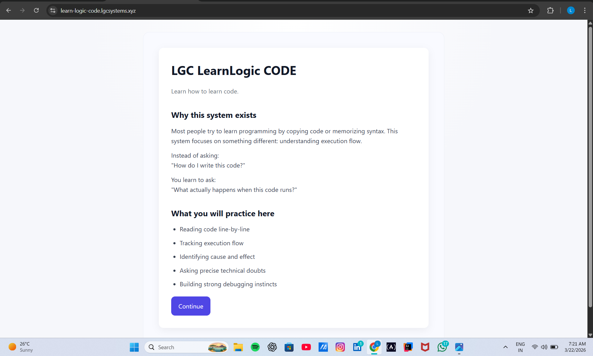
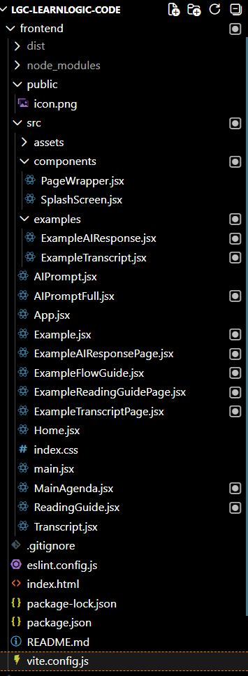

# 💻 LearnLogic CODE — Development Documentation

This documentation captures the **development journey of LearnLogic CODE** —  
an execution-based learning system focused on **learning by doing, not consuming**.

It highlights:
> **how the system was built, debugged, structured, and evolved**

---

## 🧬 What This Documentation Captures

This is not a feature overview.

It documents:
- early development struggles  
- debugging process  
- UI evolution  
- project structuring decisions  

Each screenshot reflects a **real development stage or issue**.

---

## 🧠 Purpose

- Track development progress  
- Capture debugging insights  
- Document system structure evolution  
- Provide visual evidence of implementation  

---

## 📂 Phase 1 — Early Development & Debugging

### 🔹 Initial Debugging (App Setup Issues)

- Early issues during React setup  
- Debugging component rendering and structure  
- Establishing base application flow  

---

### 🔹 Initial UI Experiment

- First working UI for the system  
- Focus on execution-based interaction  
- Basic layout for concept + code  

---

### 🔹 Initial Project Structure

- Early folder organization  
- Separation of concerns introduced  
- Foundation for scaling  

---

## 🔄 Phase 2 — System Stabilization & UI Direction

### 🔹 Splash Card Introduction

- Entry point for users  
- Clear starting interaction  
- Improved first impression  

---

### 🔹 Home Page UI

- Central navigation point  
- Structured layout for learning flow  
- Improved usability  

---

## 🧱 Phase 3 — Structure & Organization (v2)

### 🔹 Frontend Folder Structure

- Organized React project structure  
- Clear separation:
  - components  
  - pages  
  - logic layers  

---

### 🔹 Root-Level Project Files

- Clean root configuration  
- Environment and build setup  
- Project-level organization  

---

## 🔍 Key Learnings

- Early debugging defines system stability  
- Clean structure reduces future complexity  
- UI clarity improves execution-based learning  
- Iterative improvement is more effective than over-planning  

---

## 🧭 How to Use This Documentation

- Follow phases to understand system evolution  
- Refer debugging section for early issues  
- Use structure references before scaling the project  
- Treat this as development history, not notes  

---

## 👤 Author

**Ramalingam Jayavelu**  
LGC Systems