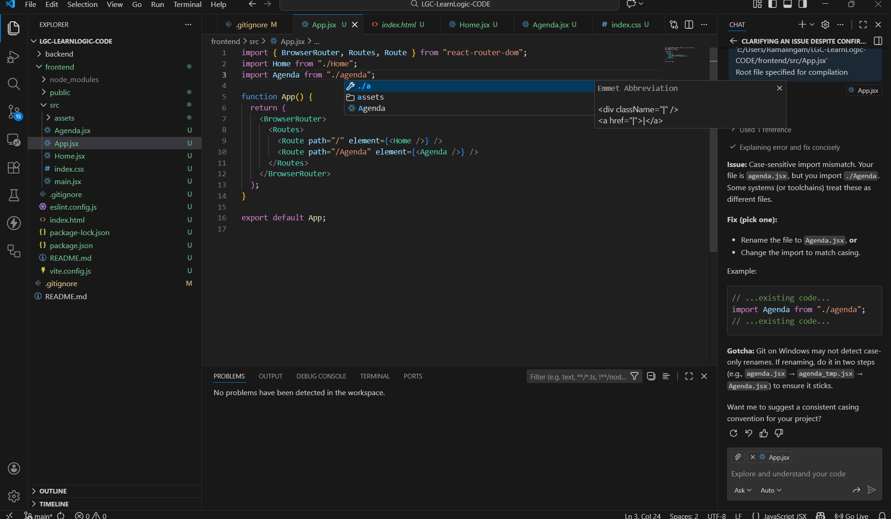
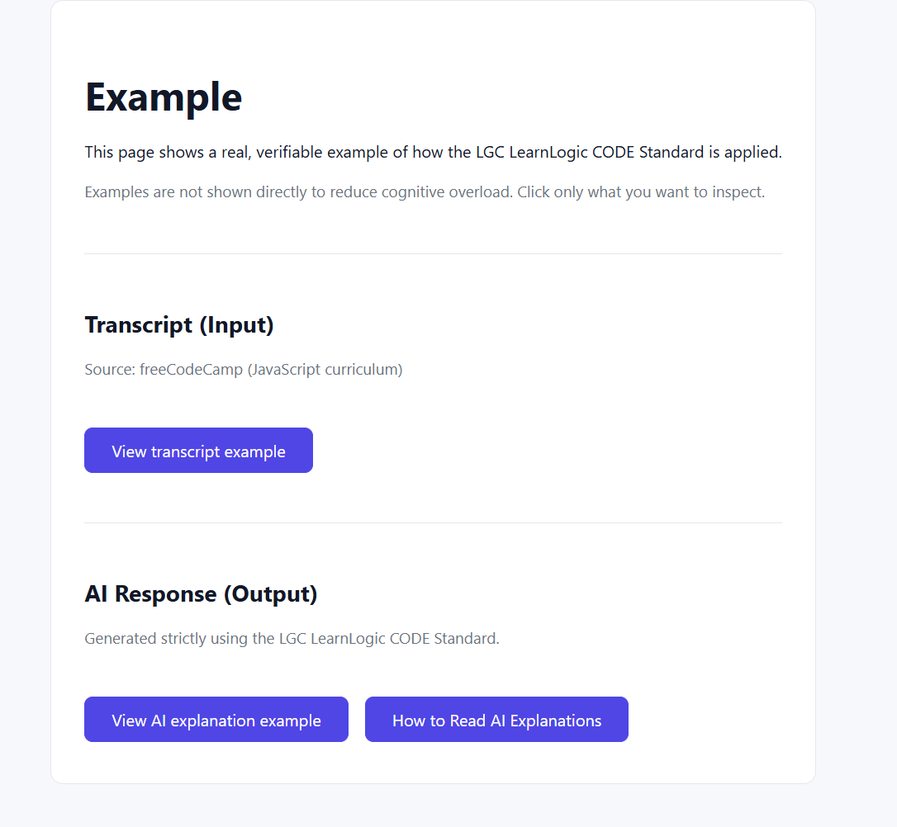
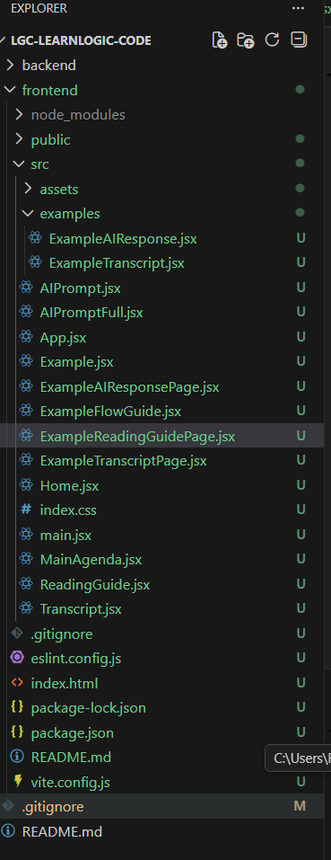
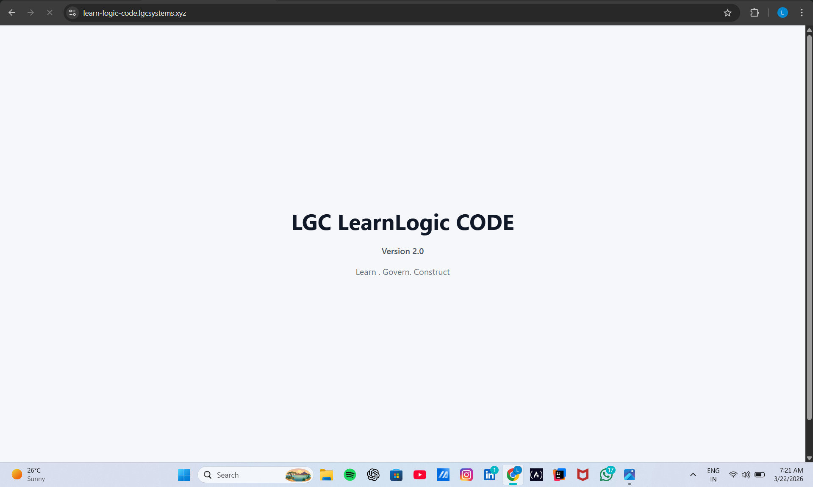
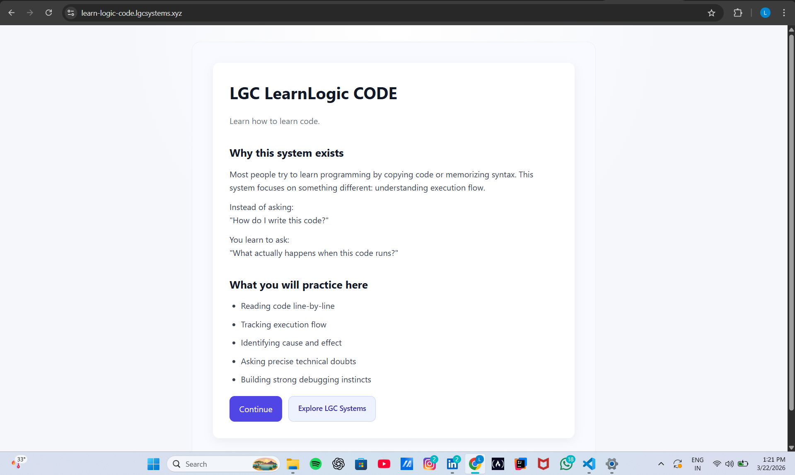
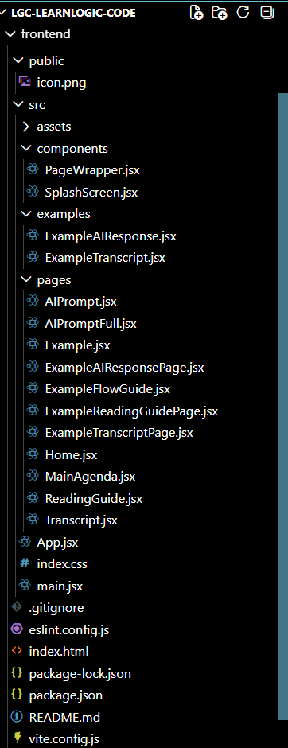
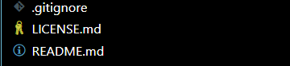

# 💻 LearnLogic CODE — Development Documentation

This documentation captures the **engineering journey of LearnLogic CODE** —  
an execution-based learning system focused on:

> **learning by doing, understanding execution flow, and verifying through reasoning**

This is not a feature showcase.  
This is a **build story**.

---

## 🧬 What This Documentation Represents

This documentation captures:

- how the system started  
- what problems were faced  
- how those problems were debugged  
- how the structure evolved over time  

Each screenshot is not just UI — it is:
> **evidence of a development decision**

---

## 🧠 Purpose

- Track real development progress  
- Capture debugging insights  
- Show architectural evolution  
- Provide visual proof of system growth  

---

## 📂 Phase 1 — Early Development & Debugging

### 🔹 Initial Debugging (App Setup Issues)

- Initial issues in React setup  
- Debugging rendering flow and component structure  
- Establishing base execution flow  

---

### 🔹 Initial UI Experiment

- First working UI  
- Focus on execution-based learning interaction  
- Minimal structure, maximum experimentation  

---

### 🔹 Initial Project Structure

- Early folder organization  
- Basic separation introduced  
- Foundation laid for future scaling  

---

## 🔄 Phase 2 — UI Direction & System Identity

### 🔹 Splash Card Introduction

- Defined system entry point  
- Improved first interaction  
- Established system identity  

---

## 🚀 Phase 2.5 — Home Page Evolution (Ecosystem Integration)

### 🔹 Before — Standalone Learning Entry

- Focused learning entry  
- No external navigation  
- Pure system interaction  

---

### 🔹 After — LGC Systems Navigation Introduced

- Added entry point to LGC Systems  
- Maintains clean UI and visual balance  
- Does not interrupt learning flow  

🧠 **Decision Insight:**
- Navigation added only on Home page  
- Avoided placing inside learning flow  
- Preserved execution-focused experience  
- Aligns LearnLogic CODE with LGC ecosystem  

---

## 🧱 Phase 3 — Structural Evolution (Architecture Refactor)

### 🔹 Before Refactor — Flat Structure

- All files located in root `src/`  
- Limited scalability  
- Harder to maintain as system grows  

---

### 🔹 After Refactor — Structured Architecture (v2)

📅 22 March 2026

- Introduced:
  - `pages/` → route-level components  
  - `components/` → reusable UI  
  - `examples/` → controlled learning scenarios  

- Improved:
  - code readability  
  - maintainability  
  - scalability  

---

### 🔹 Root-Level Project Structure

- Clean project configuration  
- Organized environment and build setup  
- Stable system foundation  

---

## 🔍 Key Engineering Learnings

- Early debugging defines long-term stability  
- Structure is not organization — it is **system design**  
- File movement impacts system behavior (import paths, flow)  
- UI should guide learning, not distract from it  

🔥 **New Insight:**
- Ecosystem navigation must be intentional  
- Entry points should not disrupt deep learning flows  

---

## 🧠 Core Insight

> A system is not built in one step.  
> It evolves through debugging, restructuring, and decisions.

This documentation reflects that evolution.

---

## 🧭 How to Use This Documentation

- Follow phases sequentially to understand system growth  
- Refer debugging sections for early challenges  
- Use structure comparison before scaling your own projects  
- Treat this as **engineering history**, not notes  

---

## 👤 Author

**Ramalingam Jayavelu**  
LGC Systems